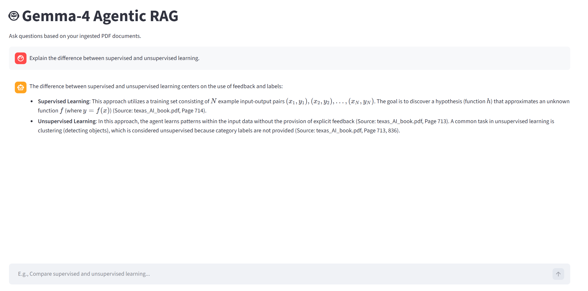
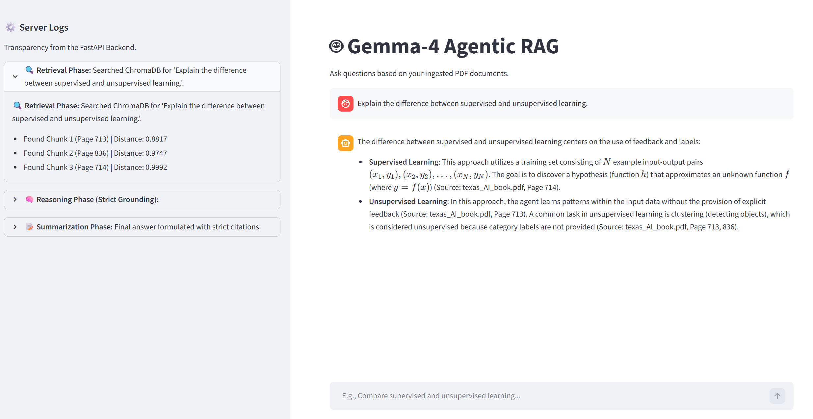
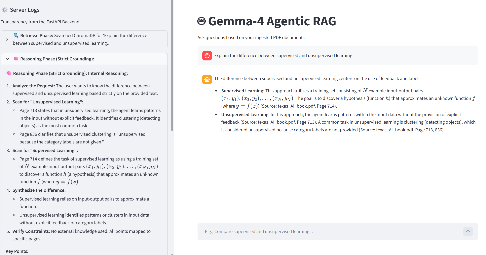
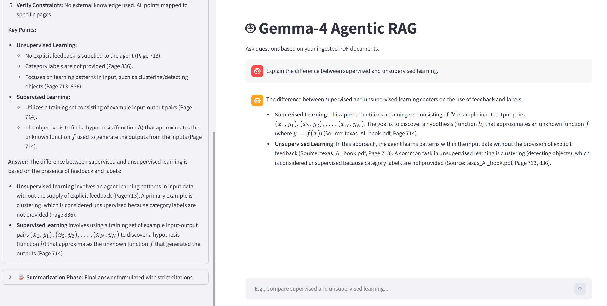

# Agentic RAG Pipeline (AI Russell Norvig Book - Texas) 

---

## 1. System Architecture

This project implements a **Retrieval-Augmented Generation (RAG)** pipeline with an agentic workflow. It is composed of three primary layers: a document ingestion pipeline, a FastAPI backend, and a Streamlit frontend.

```
┌─────────────────────────────────────────────────────────────┐
│                        USER INTERFACE                       │
│                  Streamlit App  (app.py)                    │
│           Chat Input ──► HTTP POST /chat ──► Display        │
└────────────────────────────┬────────────────────────────────┘
                             │ REST API (port 8000)
┌────────────────────────────▼────────────────────────────────┐
│                    FASTAPI BACKEND (backend.py)             │
│                                                             │
│   ┌──────────┐    ┌──────────┐    ┌──────────────────┐      │
│   │ Retrieve │───►│  Reason  │───►│    Summarize     │      │
│   │  Node    │    │  Node    │    │     Node         │      │
│   └────┬─────┘    └────┬─────┘    └────────┬─────────┘      │
│        │               │                   │                │
│   ChromaDB         Gemma-4 LLM        Gemma-4 LLM           │
│   (Vector DB)    (Grounded Analysis) (Cited Response)       │
└────────────────────────────────────────────────────────────-┘
                             │
┌────────────────────────────▼────────────────────────────────┐
│               INGESTION PIPELINE (ingest.py)                │
│  PDF ──► PyMuPDF Loader ──► Text Splitter ──► Embeddings    │
│                                          ──► ChromaDB       │
└─────────────────────────────────────────────────────────────┘
```

### Key Components

| Component | Technology | Role |
|---|---|---|
| Frontend | Streamlit | User chat interface and log display |
| Backend API | FastAPI + Uvicorn | Orchestrates the agentic workflow |
| Workflow Engine | LangGraph | Manages the node-based state graph |
| Language Model | Gemma-4 (via Google Generative AI) | Reasoning and answer generation |
| Vector Database | ChromaDB (persistent) | Stores and retrieves document embeddings |
| Embedding Model | `all-MiniLM-L12-v2` | Converts text to semantic vectors |
| Document Loader | PyMuPDFLoader | Parses and extracts content from PDFs |

---

## 2. Memory and Vector Store

### How Documents Are Ingested

Document ingestion is a one-time (or on-demand) process handled by `ingest.py`. The steps are as follows:

1. **Load** : The target PDF is loaded using `PyMuPDFLoader`, which extracts text page by page.
2. **Chunk** : The text is split into overlapping segments using `RecursiveCharacterTextSplitter` with a chunk size of 1,000 characters and an overlap of 150 characters. This overlap ensures that context is not lost at chunk boundaries.
3. **Embed** : Each chunk is passed through the `all-MiniLM-L12-v2` sentence transformer model, producing a 384-dimensional dense vector representation.
4. **Store** : The chunks, their embeddings, and metadata (page number, source filename) are stored in a **ChromaDB persistent collection**. The database is written to disk at the path defined by `CHROMA_PATH` in the `.env` file.

> The embedding model and ChromaDB collection are re-used at query time, so consistency between ingestion and retrieval is guaranteed.

### How Context Is Retrieved at Query Time

When a user submits a question, the backend executes the following retrieval process:

1. **Encode the query** : The user's question is converted to a vector using the same `all-MiniLM-L12-v2` model.
2. **Semantic search** : ChromaDB performs a nearest-neighbour search against stored embeddings using cosine distance, returning the top 3 most relevant chunks.
3. **Metadata attachment** : Each retrieved chunk is returned with its page number and distance score, providing full traceability back to the source document.

> There is no persistent conversational memory between sessions. Each query is processed independently. The chat history visible in the Streamlit interface is stored only in `st.session_state` for the duration of the browser session.

---

## 3. Agentic Workflow

The backend processes each query through a three-node LangGraph state graph:

### Node 1 — Retrieve
Encodes the user question, queries ChromaDB for the top 3 semantically relevant chunks, and appends retrieval logs (chunk index, page number, distance score) to the workflow state.

### Node 2 — Reason
Passes the retrieved chunks to Gemma-4 with a strict grounding prompt. The model is instructed to reason only from the provided context and to explicitly note which page each point originates from. It will state clearly if the answer cannot be found in the document.

### Node 3 — Summarize
Takes the internal reasoning output and instructs Gemma-4 to produce a clean, professional final answer with inline citations in the format `(Source: filename.pdf, Page X)`.

---

## 4. User Guide

### Prerequisites

- Python virtual environment located at `.\.venv\` (one level above the project folder)
- A `.env` file configured with the following variables:

```
GOOGLE_API_KEY= your_google_api_key
CHROMA_PATH= ./chroma_db
COLLECTION_NAME= ai_knowledge_base
```

---

### Step 1 — Ingest Documents

Run this step once before starting the application, or whenever new documents need to be added.

1. Place your PDF file in the `data/` folder.
2. Open `ingest.py` and confirm the filename in the `ingest_pdf(...)` call at the bottom of the file.
3. Execute the ingestion script by double-clicking **`run_ingest.bat`**.

The terminal will display a progress bar as chunks are uploaded to ChromaDB. Wait for the `✅ Ingestion complete!` message before proceeding.

---

### Step 2 — Start the Application

Double-click **`start.bat`** to launch the full application stack. This script will:

1. Activate the virtual environment.
2. Launch the **FastAPI backend** in a separate terminal window (loads models and starts on port 8000).
3. Wait 5 seconds for the backend to initialise.
4. Launch the **Streamlit frontend** in your default browser.

> Do not close the FastAPI terminal window while the application is running.

---

### Step 3 — Ask Questions

1. Type your question into the chat input field at the bottom of the Streamlit page.
2. The query is sent to the FastAPI backend, which runs the full Retrieve → Reason → Summarize workflow.
3. The final answer is displayed in the chat window, with citations referencing the source document and page number.
4. Workflow logs (retrieval details, reasoning output, and summarisation status) are available in the **Server Logs** panel in the left sidebar.

---

### Troubleshooting

| Issue | Likely Cause | Resolution |
|---|---|---|
| `Failed to connect to backend` | FastAPI server not running | Ensure the FastAPI terminal window is open and shows no errors |
| `API Error 500` | Backend exception | Check the FastAPI terminal for the full traceback |
| Empty or irrelevant answers | Poor retrieval match | Rephrase the question or verify the document was ingested correctly |
| `Collection not found` | Ingestion not run | Run `run_ingest.bat` before starting the app |

---

## 5. Potential Future Enhancements

### 1. Persistent Conversational Memory
Right now, the chatbot treats every question as new and has no memory of previous messages. Adding chat history support would let the model understand follow-up questions, such as "Can you explain that further?" without losing track of what was discussed earlier.

### 2. Multi-Document Support
The system currently works with one PDF at a time. Expanding it to load multiple documents at once would let users ask questions across a wider set of materials, with answers still traced back to the correct file and page.

### 3. Better Retrieval Ranking
The system retrieves the top 3 chunks based on how similar they are to the question. Adding a second-pass ranking step would re-score those chunks more carefully, helping the model pick the most relevant content and produce more accurate answers.

### 4. Smarter Query Handling
At the moment, every question goes through the same pipeline regardless of whether it is answerable from the document. Adding a routing step at the start would let the system detect when a question is out of scope and respond with a clear message, rather than returning an unhelpful or fabricated answer.

### 5. Multi-User Support with Authentication
The current setup is built for a single user running locally. Adding login support and separate document collections per user would make the system usable in a team or organisational setting, where different users may need access to different documents.


## Example Output


## Retrieval Phase


## Reasoning Phase


